# Sharma Electrical Services

[](https://reactjs.org/)
[](https://vitejs.dev/)
[](https://styled-components.com/)
[](LICENSE)

A modern, responsive React-based website for Sharma Electrical Services, showcasing professional electrical solutions in Hyderabad. Built with cutting-edge technologies for optimal performance and user experience.

## 🚀 Live Demo

[View Live Website](https://sharma-electrical-services.vercel.app/)

## 📋 Table of Contents

- [Features](#features)
- [Screenshots](#screenshots)
- [Technologies Used](#technologies-used)
- [Prerequisites](#prerequisites)
- [Installation](#installation)
- [Usage](#usage)
- [Project Structure](#project-structure)
- [Customization](#customization)
- [Deployment](#deployment)
- [Contributing](#contributing)
- [License](#license)
- [Contact](#contact)

## ✨ Features

### Core Functionality

- **Responsive Design**: Fully responsive across all devices (mobile, tablet, desktop)
- **Modern UI/UX**: Clean, professional design with smooth animations
- **Performance Optimized**: Built with Vite for fast loading and development
- **Accessibility**: WCAG compliant with proper ARIA labels and keyboard navigation
- **SEO Friendly**: Optimized meta tags and semantic HTML structure

### Website Sections

- **Hero Section**: Eye-catching landing with company stats and call-to-action
- **Services**: Comprehensive electrical services offered
- **Why Choose Us**: Key differentiators and company values
- **Our Work**: Before/after comparison slider showcasing electrical installations
- **Projects**: Portfolio of completed electrical projects
- **Testimonials**: Client reviews and feedback
- **About Us**: Company history and expertise
- **Contact**: Multiple contact methods and business hours

### Interactive Elements

- **Comparison Slider**: Interactive before/after image comparison
- **Animated Statistics**: Auto-animating counters for company metrics
- **Smooth Scrolling**: Enhanced navigation with smooth scroll behavior
- **Hover Effects**: Engaging micro-interactions throughout the site
- **Scroll Animations**: Elements animate into view as you scroll

### Technical Features

- **Component-Based Architecture**: Modular, reusable React components
- **Custom Hooks**: Specialized hooks for animations and interactions
- **Theme System**: Comprehensive design tokens and consistent styling
- **Font Awesome Icons**: Professional iconography throughout
- **Google Fonts**: Modern typography with Poppins font family

## 📸 Screenshots

### Homepage

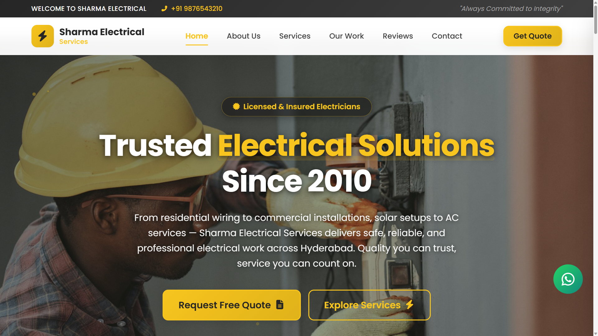
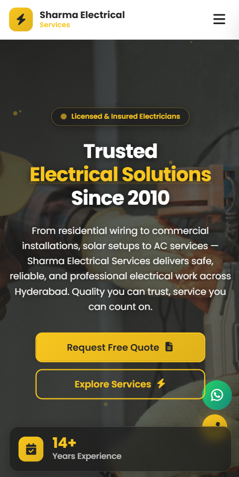

### Services Section

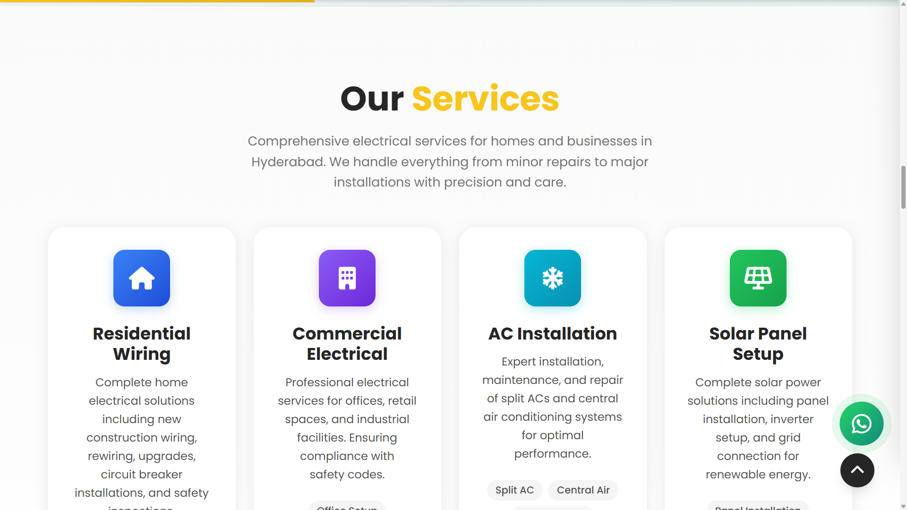
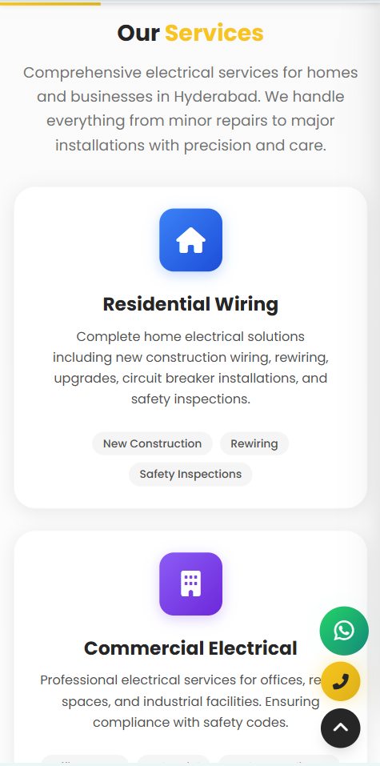

### Why Choose Us

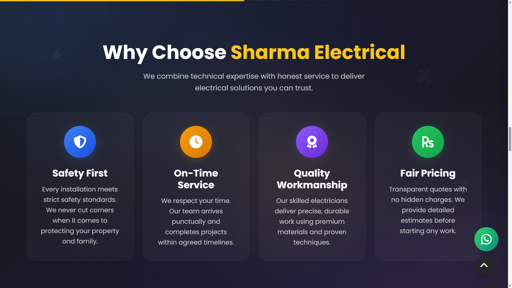
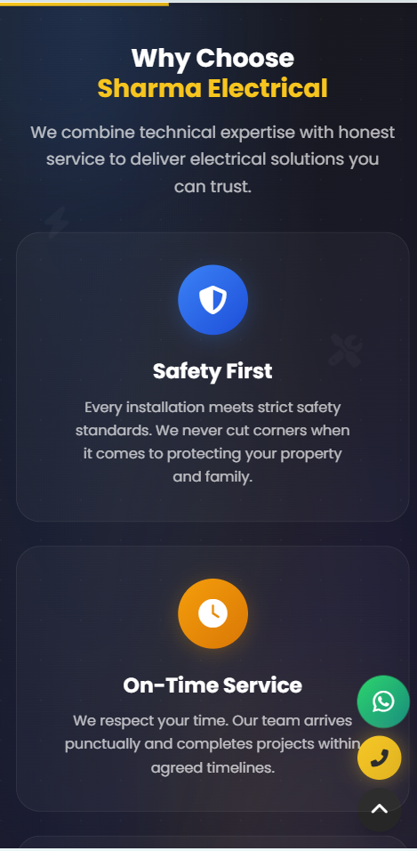

### Our Projects

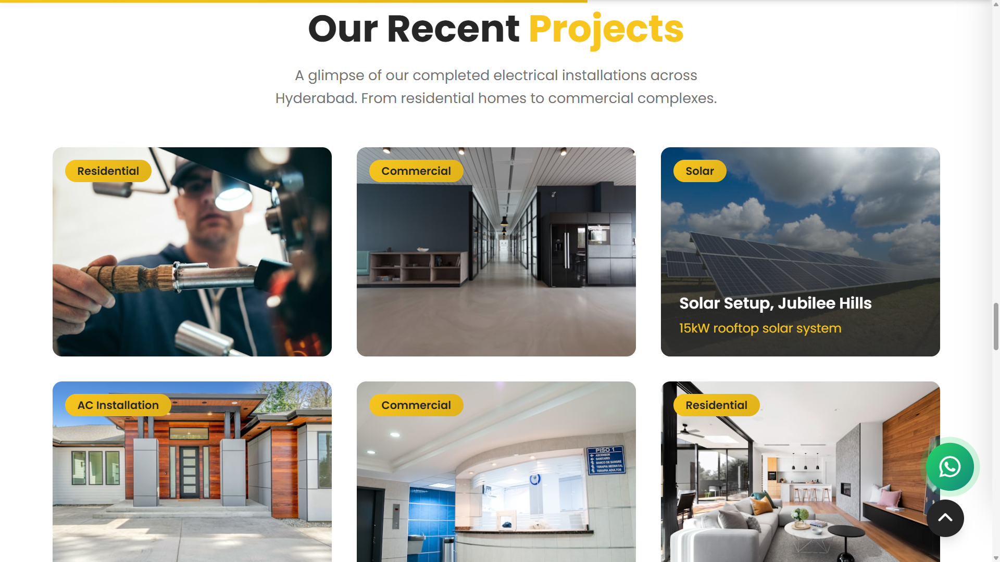
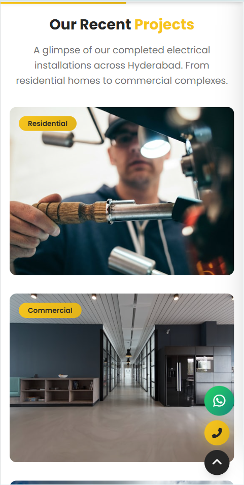

### About Us

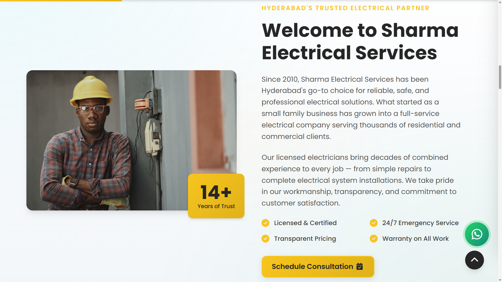
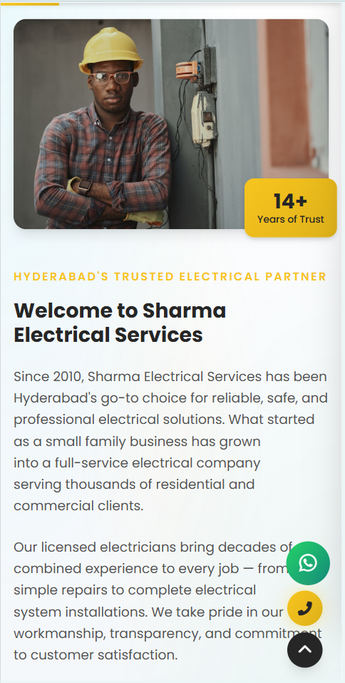

### Contact Us

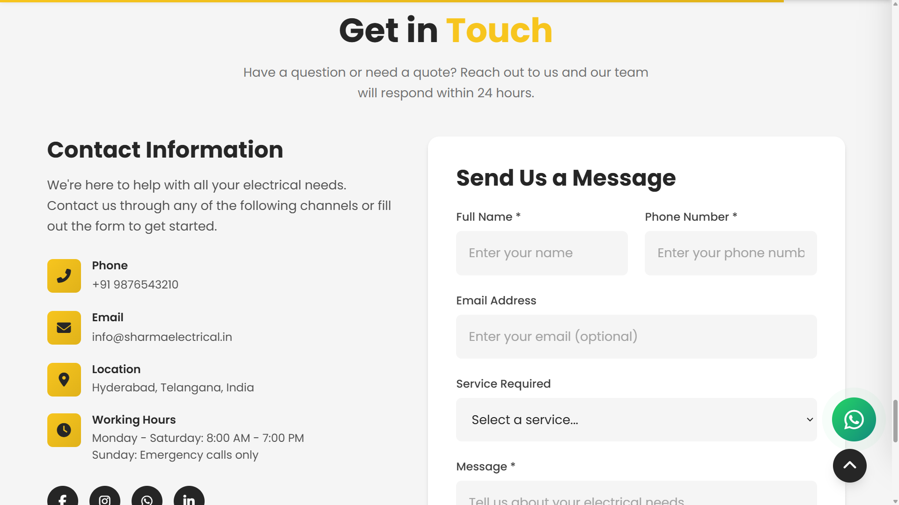
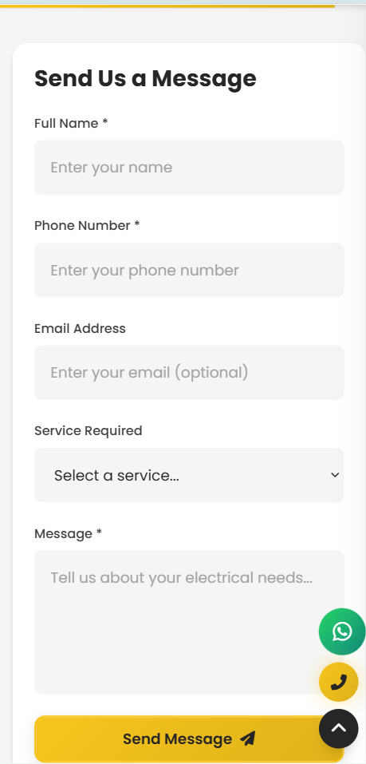

### Footer

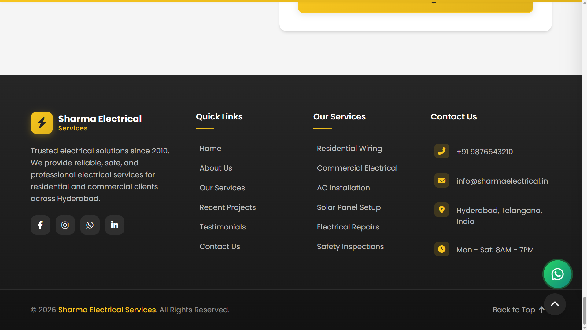


### Additional Work Images

- **Comparison Slider**: [Before/After Work](docs/comparision_work.png)
- **Comparison Section**: [Work Showcase](docs/comparision_sm.png)
- **Mobile Menu**: [Navigation Menu](docs/menu_sm.png)

_All work images are located in the `docs/` folder and showcase the professional electrical work performed by Sharma Electrical Services._

## 🛠 Technologies Used

### Frontend Framework

- **React 19.2.0** - Modern JavaScript library for building user interfaces
- **React Router DOM 7.11.0** - Declarative routing for React applications

### Build Tool & Development

- **Vite 5.1.1** - Fast build tool and development server
- **ESLint 9.39.1** - Code linting and formatting
- **Babel Plugin React Compiler** - React compilation optimizations

### Styling & UI

- **Styled Components 6.2.0** - CSS-in-JS library for component styling
- **Font Awesome** - Professional icon library
- **Google Fonts (Poppins)** - Modern typography

### Development Tools

- **npm** - Package management
- **Git** - Version control
- **VS Code** - Code editor

## 📋 Prerequisites

Before running this project, make sure you have the following installed:

- **Node.js** (version 18.0.0 or higher)
- **npm** (comes with Node.js) or **yarn**
- **Git** (for cloning the repository)

You can check your versions by running:

```bash
node --version
npm --version
git --version
```

## 🚀 Installation

1. **Clone the repository**

   ```bash
   git clone https://github.com/LEKKALAGANESH/sharma_electrical_services.git
   
   cd sharma-electrical
   ```

2. **Install dependencies**

   ```bash
   npm install
   ```

3. **Start the development server**

   ```bash
   npm run dev
   ```

4. **Open your browser**

   Navigate to `http://localhost:5173` (or the port shown in your terminal)

## 📖 Usage

### Development

```bash
# Start development server with hot reload
npm run dev

# Build for production
npm run build

# Preview production build
npm run preview

# Run ESLint for code quality
npm run lint
```

### Customization

#### Changing Content

- Edit text content in the respective component files in `src/components/sections/`
- Update contact information in `src/components/layout/Footer/Footer.jsx`
- Modify services in `src/components/sections/Services/Services.jsx`

#### Styling Changes

- Theme variables are defined in `src/styles/theme.js`
- Component-specific styles are in their respective `.jsx` files
- Global styles are in `src/styles/GlobalStyles.js`

#### Adding New Sections

1. Create a new component in `src/components/sections/`
2. Add it to the exports in `src/components/sections/index.js`
3. Import and add to the `HomePage` component in `src/App.jsx`

## 📁 Project Structure

```
sharma_electrical/
├── docs/                          # Work images and documentation
│   ├── home_lg.png               # Homepage large screen
│   ├── home_sm.png               # Homepage small screen
│   ├── services_lg.png           # Services section large screen
│   ├── services_sm.png           # Services section small screen
│   ├── why_us_lg.png             # Why Us section large screen
│   ├── why_us_sm.png             # Why Us section small screen
│   ├── our_projects_lg.png       # Projects section large screen
│   ├── our_projects_sm.png       # Projects section small screen
│   ├── about_us_lg.png           # About Us section large screen
│   ├── about_us_sm.png           # About Us section small screen
│   ├── contact_us_lg.png         # Contact section large screen
│   ├── contact_us_sm.png         # Contact section small screen
│   ├── footer_lg.png             # Footer large screen
│   ├── footer_sm.png             # Footer small screen
│   ├── comparision_work.png      # Work comparison images
│   ├── comparision_sm.png        # Comparison section small screen
│   └── menu_sm.png               # Mobile menu
├── public/                        # Static assets
│   ├── favicon.svg               # Website favicon
│   └── vite.svg                  # Vite logo
├── src/
│   ├── assets/                   # Images and media files
│   ├── components/
│   │   ├── layout/               # Layout components
│   │   │   ├── Header/           # Navigation header
│   │   │   ├── Footer/           # Website footer
│   │   │   └── Layout/           # Main layout wrapper
│   │   ├── sections/             # Page sections
│   │   │   ├── Hero/             # Hero/landing section
│   │   │   ├── Services/         # Services offered
│   │   │   ├── WhyUs/            # Why choose us
│   │   │   ├── Comparison/       # Work comparison slider
│   │   │   ├── Projects/         # Project portfolio
│   │   │   ├── About/            # About the company
│   │   │   ├── Testimonials/     # Client testimonials
│   │   │   ├── CTA/              # Call-to-action section
│   │   │   └── Contact/          # Contact information
│   │   └── ui/                   # Reusable UI components
│   │       ├── Button/           # Custom button component
│   │       ├── Card/             # Card component
│   │       ├── Container/        # Layout container
│   │       ├── FloatingElements/ # Animated background elements
│   │       └── SectionHeader/    # Section title component
│   ├── hooks/                    # Custom React hooks
│   │   ├── useActiveSection.js   # Active section tracking
│   │   ├── useIntersectionObserver.js # Intersection observer
│   │   ├── useReducedMotion.js   # Reduced motion detection
│   │   ├── useScrollAnimation.js # Scroll-based animations
│   │   └── useScrollProgress.js  # Scroll progress tracking
│   ├── styles/                   # Styling files
│   │   ├── theme.js              # Design system tokens
│   │   ├── GlobalStyles.js       # Global CSS styles
│   │   ├── reset.css             # CSS reset
│   │   └── variables.css         # CSS custom properties
│   ├── App.jsx                   # Main application component
│   ├── App.css                   # Application styles
│   ├── index.css                 # Global styles
│   └── main.jsx                  # Application entry point
├── .gitignore                    # Git ignore rules
├── eslint.config.js              # ESLint configuration
├── index.html                    # HTML template
├── package.json                  # Project dependencies
├── package-lock.json             # Dependency lock file
├── README.md                     # Project documentation
└── vite.config.js                # Vite configuration
```

## 🎨 Customization

### Color Scheme

The website uses a professional yellow/gold (#f7c51e) as the primary color with a dark theme. Colors are defined in `src/styles/theme.js`.

### Typography

- **Primary Font**: Poppins (Google Fonts)
- **Sizes**: Responsive clamp() functions for optimal readability
- **Weights**: Light (300) to Extra Bold (800)

### Animations

- Respect `prefers-reduced-motion` for accessibility
- Smooth transitions and micro-interactions
- Scroll-triggered animations for engagement

## 🚀 Deployment

### Vercel (Recommended)

1. Connect your GitHub repository to Vercel
2. Vercel will automatically detect Vite and configure build settings
3. Deploy with zero configuration

### Netlify

1. Build the project: `npm run build`
2. Upload the `dist` folder to Netlify
3. Configure build command: `npm run build`
4. Set publish directory: `dist`

### Manual Deployment

1. Build the project: `npm run build`
2. Upload the `dist` folder to your web server
3. Ensure proper MIME types for JavaScript modules

## 🤝 Contributing

We welcome contributions! Please follow these steps:

1. Fork the repository
2. Create a feature branch: `git checkout -b feature/amazing-feature`
3. Commit your changes: `git commit -m 'Add amazing feature'`
4. Push to the branch: `git push origin feature/amazing-feature`
5. Open a Pull Request

### Development Guidelines

- Follow the existing code style and structure
- Test your changes thoroughly
- Update documentation as needed
- Ensure responsive design works across all devices


## 📞 Contact

**Sharma Electrical Services**

- **Phone**: +91 9876543210
- **Email**: info@sharmaelectrical.in
- **Address**: Hyderabad, Telangana, India
- **Business Hours**: Monday - Saturday: 8AM - 7PM
- **Website**: [sharmaelectrical.in](https://sharmaelectrical.in)

### Social Media

- **Facebook**: [facebook.com/sharmaelectrical](https://facebook.com/sharmaelectrical)
- **Instagram**: [instagram.com/sharmaelectrical](https://instagram.com/sharmaelectrical)
- **WhatsApp**: [+91 9876543210](https://wa.me/919876543210)
- **LinkedIn**: [linkedin.com/company/sharmaelectrical](https://linkedin.com/company/sharmaelectrical)

---

**Built with ❤️ by Sharma Electrical Services Team**

_Professional Electrical Solutions Since 2010_
